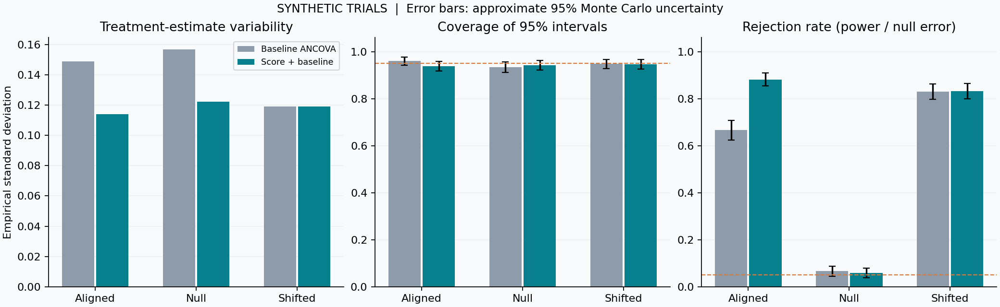

# NeuroTwin Trial Lab

**A reproducible neuroscience methods portfolio project:** simulate prognostic adjustment in randomized trials, stress-test its statistical behavior, and inspect a separate synthetic EEG processing example.

Inspired by Wang et al. (2025), [Using AI-generated digital twins to boost clinical trial efficiency in Alzheimer's disease](https://doi.org/10.1002/trc2.70181). This is an independent educational simulation using invented data and a small ridge model. It is not a reproduction of the paper's CRBM, a FINGERS-7B implementation, a clinical tool, or a working BCI.

## Run once

Install Python 3.12, download or clone the repository, open a terminal in its folder, then run:

```sh
python start.py
```

The first run creates `.venv`, installs the pinned packages from PyPI, and runs the experiment. Later runs reuse that environment. On Windows, you can also double-click **run-demo.cmd**. No API key, GPU, account, or patient dataset is needed.

Open **results/report.html** after completion. The run also creates machine-readable JSON/CSV and figures. A [checked-in example report](docs/example/report.html) is provided under `docs/example/` (download it to open in a browser).



The seed-42 example runs 500 repetitions for each of three scenarios (1,500 trials total). The aligned scenario shows 41.4% lower empirical treatment-estimator variance; null rejection is 5.8% with Monte Carlo SE 1.0%; removing extra prognostic information gives essentially no variance benefit (ratio 1.001). These are synthetic results under the stated generator, not the paper's clinical results. Eleven automated tests cover statistical calculations, signal behavior, and reproducibility.

For an existing Python environment:

```sh
python -m pip install -r requirements.txt
python run.py --seed 42 --replicates 500 --out results
python -m unittest discover -s tests -v
```

## Research question

Can a prognostic score trained on an independent historical cohort improve precision when added to a randomized trial analysis? What happens under a null treatment effect or a shift in the outcome-generating mechanism?

- **Trial simulation:** compare baseline-adjusted ANCOVA with score-augmented ANCOVA using the same randomized participants.
- **Evaluation:** treatment bias, empirical estimator variability, robust standard errors, interval coverage, power, and null rejection rate across repeated trials.
- **EEG bridge:** simulate eight channels, flag contaminated epochs, estimate Welch power spectra, and extract theta/alpha/beta power. This independent module demonstrates signal-processing foundations; it does not connect EEG to Alzheimer's risk or trial outcomes.

The historical predictor is fixed before any trial outcomes are generated. No historical patients replace randomized controls. Sample-size formulae are illustrations under strong assumptions, not a proposal for a real clinical trial.

## Project map

| File | Purpose |
| --- | --- |
| `neurotwin/trial.py` | Synthetic cohorts, frozen ridge score, ANCOVA, Monte Carlo evaluation |
| `neurotwin/eeg.py` | Signal generation, artifact quality checks, spectral features |
| `run.py` | One reproducible experiment and report export |
| `tests/` | Numerical, reproducibility, and signal-processing checks |
| `docs/RESEARCH_NOTES.md` | Paper-to-code mapping, assumptions, limits |
| `docs/SOURCES.md` | Source provenance and citations |
| `docs/EEG_BRIDGE.md` | What the EEG extension demonstrates |

## Building toward neuroengineering R&D

Be able to explain randomization, prognostic versus causal predictions, data leakage, confidence intervals, domain shift, sampling frequency, spectral power, and artifact rejection. The next separate research milestone is a consented public EEG dataset with subject-disjoint evaluation and a defined decoding task. That work is not implemented here.

This repository was created with AI assistance. Commit history records concrete implementation steps; all displayed results must come from executed code. It makes no claim of clinical validation, institutional affiliation, or researcher credentials.

Original code is MIT licensed. Referenced papers, model names, and third-party resources retain their own rights. No source PDF, model weights, or participant data are redistributed.
